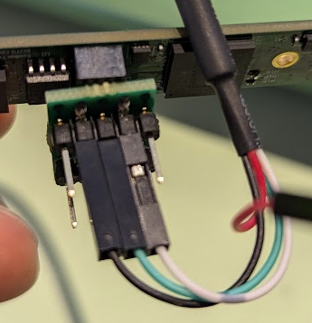

# CX3AR0234CS Custom Camera Firmware

STATUS: DEVELOPMENT (need help)

This is the firmware for a custom camera using a AR0234CS Sensor and CX3 (CYUSB3065-BZXI) chip by Infineon. 

Requirements:
* Receive images from the camera at a monochrome resolution of 1920x1200 at 100fps in a lossless format.

## How to Help

See the issues for a detailed description of what where we need help. Fork the repo, make the changes and submit a pull request.

## Getting Started

### Prerequisites
1. Get the camera board and plug it in to your computer.
2. Install the [Cypress FX3 SDK](https://www.cypress.com/documentation/software-and-drivers/ez-usb-fx3-software-development-kit)

### Setup the Project
1. Clone the repository
2. Open the EZ-USB Suite
3. Click on "File" > "Import" > "General" > "Existing Projects into Workspace"
4. Select the folder where you cloned the repository and click "Finish"

### Build the Firmware
1. Open the project in the EZ-USB Suite
2. Right click on the project and click "Build Project"
3. If the build is successful, you should see a message in the console that says "Build Finished"

### Flash the Firmware
1. Press Ctrl + 6 to open the control center. There you should see any device that are available to flash.
2. Click on the device.
3. Select the Program menu > FX3 > RAM
4. In the file dialog, select the .img file that was generated in the build step. Usually it is located in the "Debug" folder of the project.
4. After the firmware is flashed, the camera can be used with the default Camera App on Windows.

### Read UART Debug Messages
1. Connect a USB to TTL serial cable ([this one](https://www.adafruit.com/product/954) works) adapter to the UART pins on the camera board.
2. Open a serial terminal (like hterm) and select the com port to read and press connect.
3. Use settings 115200 baud, 8 data bits, 1 stop bit, no parity, no flow control. Newline mode should be set to "CR".
4. When camera is streaming, you should see debug messages in the hterm.

## Read registers using JTAG
* TODO: document this.

## AR0234CS Sensor
[Product Link](https://www.onsemi.com/products/sensors/image-sensors/ar0234cs)

This sensor is monochrome and has a resolution of 1920x1200. It can output images at 100fps.

## CX3 (CYUSB3065-BZXI) chip by Infineon
The CX3 Infineon chip is a USB 3.0 peripheral controller that enables developers to add USB 3.0 connectivity to any image sensor compliant with the Mobile Industry Processor Interface (MIPI) Camera Serial Interface Type 2 (CSI-2) standard.

